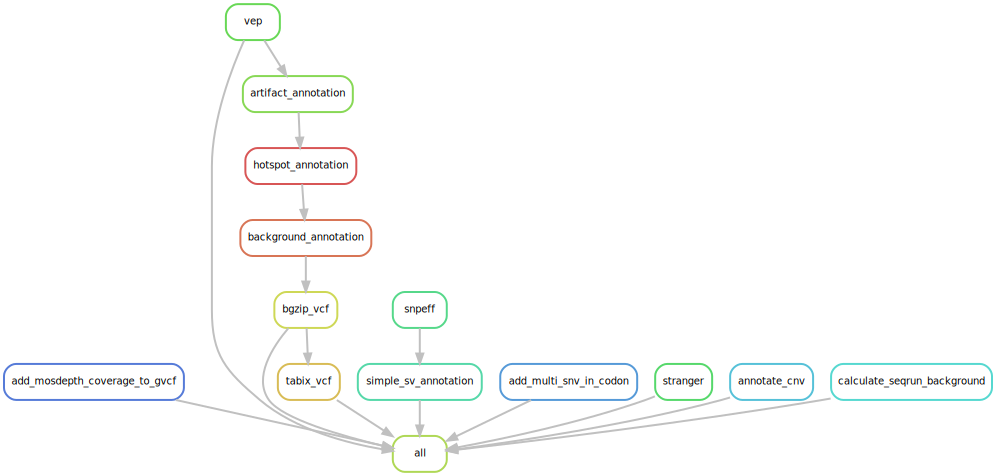

# :snake: hydra-genetics/annotation

Snakemake module containing processing steps for variant annotation.


[](https://opensource.org/licenses/gpl-3.0.html)

## :speech_balloon: Introduction

The module consists of annotation processing steps, such as vep and artifact annotation of `.vcf`-files.

## :heavy_exclamation_mark: Dependencies

In order to use this module, the following dependencies are required:

[](https://github.com/hydra-genetics/)
[](https://pandas.pydata.org/)
[](https://www.python.org/)
[](https://snakemake.readthedocs.io/en/stable/)
[](https://sylabs.io/docs/)
[](https://pypi.org/project/drmaa/)
[](https://pypi.org/project/tabulate/)

## :school_satchel: Preparations

### Sample and unit data

Input data should be added to [`samples.tsv`](https://github.com/hydra-genetics/prealignment/blob/develop/config/samples.tsv)
and [`units.tsv`](https://github.com/hydra-genetics/prealignment/blob/develop/config/units.tsv).
The following information need to be added to these files:

| Column Id | Description |
| --- | --- |
| **`samples.tsv`** |
| sample | unique sample/patient id, one per row |
| **`units.tsv`** |
| sample | same sample/patient id as in `samples.tsv` |
| type | data type identifier (one letter), can be one of **T**umor, **N**ormal, **R**NA |
| platform | type of sequencing platform, e.g. `NovaSeq` |
| machine | specific machine id, e.g. NovaSeq instruments have `@Axxxxx` |
| flowcell | identifer of flowcell used |
| lane | flowcell lane number |
| barcode | sequence library barcode/index, connect forward and reverse indices by `+`, e.g. `ATGC+ATGC` |
| fastq1/2 | absolute path to forward and reverse reads |
| adapter | adapter sequences to be trimmed, separated by comma |

### Reference data

For VEP-annotation you need:
1. A reference genome: ex reference.fna
2. A [vep data cache](https://www.ensembl.org/info/docs/tools/vep/script/vep_cache.html) that is consistent with genome version, program version, and options used.

For Snpeff-annotation you need:
1. A [database](https://pcingola.github.io/SnpEff/download/) downloaded by the program.

## :white_check_mark: Testing

The workflow repository contains a small test dataset `.tests/integration` which can be run like so:

```bash
$ cd .tests/integration
$ snakemake -s ../../Snakefile -j1 --configfile config.yaml --use-singularity
```
## :rocket: Usage

To use this module in your workflow, follow the description in the
[snakemake docs](https://snakemake.readthedocs.io/en/stable/snakefiles/modularization.html#modules).
Add the module to your `Snakefile` like so:

```bash
module annotation:
    snakefile:
        github(
            "hydra-genetics/annotation",
            path="workflow/Snakefile",
            tag="v0.1.0",
        )
    config:
        config


use rule * from annotation as annotation_*
```

### Compatibility

Latest:
 - prealignment:v0.4.0
 - alignment:v0.2.0
 - snv_indels:v0.2.0
 - cnv_sv:v0.1.0
 - qc:v0.1.0

See [COMPATIBLITY.md](../master/COMPATIBLITY.md) file for a complete list of module compatibility.

### Input files

| File | Description |
|---|---|
| ***`hydra-genetics/qc`*** |
| `qc/mosdepth_bed/{sample}_{type}.per-base.bed.gz` | per base coverage |
| ***`hydra-genetics/snv_indel`*** |
| `snv_indels/gatk_mutect2_gvcf/{sample}_{type}.merged.g.vcf.gz` | genome vcf created by mutect2 |
| `snv_indels/bcbio_variation_recall_ensemble/{sample}_{type}.ensembled.vcf` | ensembled snv indel vcf |
| ***`hydra-genetics/cnv_sv`*** |
| `cnv_sv/svdb_query/{sample}_{type}.svdb_query.vcf` | cnv calls converted to vcf-format |

### Output files

The following output files should be targeted via another rule:

| File | Description |
|---|---|
| `qc/add_mosdepth_coverage_to_gvcf/{sample}_{type}.mosdepth.g.vcf` | genome vcf created by mutect2 with coverage from mosdepth |
| `snv_indels/bcbio_variation_recall_ensemble/{sample}_{type}.ensembled.vep_annotated.vcf` | vep annotated vcf |
| `snv_indels/bcbio_variation_recall_ensemble/{sample}_{type}.ensembled.ssa.vcf` | SnpEff annotated vcf |
| `annotation/background_annotation/{sample}_{type}.background_annotation.vcf` | vcf file annotated with background noise data |
| `annotation/artifact_annotation/{sample}_{type}.artifact_annotation.vcf` | vcf file annotated with artifact info |
| `annotation/add_multi_snv_in_codon/{file}.codon_snvs.vcf` | artifact annotated vcf file where two variants affecting the same codon are added as a separate variant |
| `cnv_sv/svdb_query/add_mosdepth_coverage_to_gvcf/{file}.annotate_cnv.{tag}.vcf` | cnv vcf file annotated with gene names for a selection of genes of interest |

## :judge: Rule Graph

### Annotation


