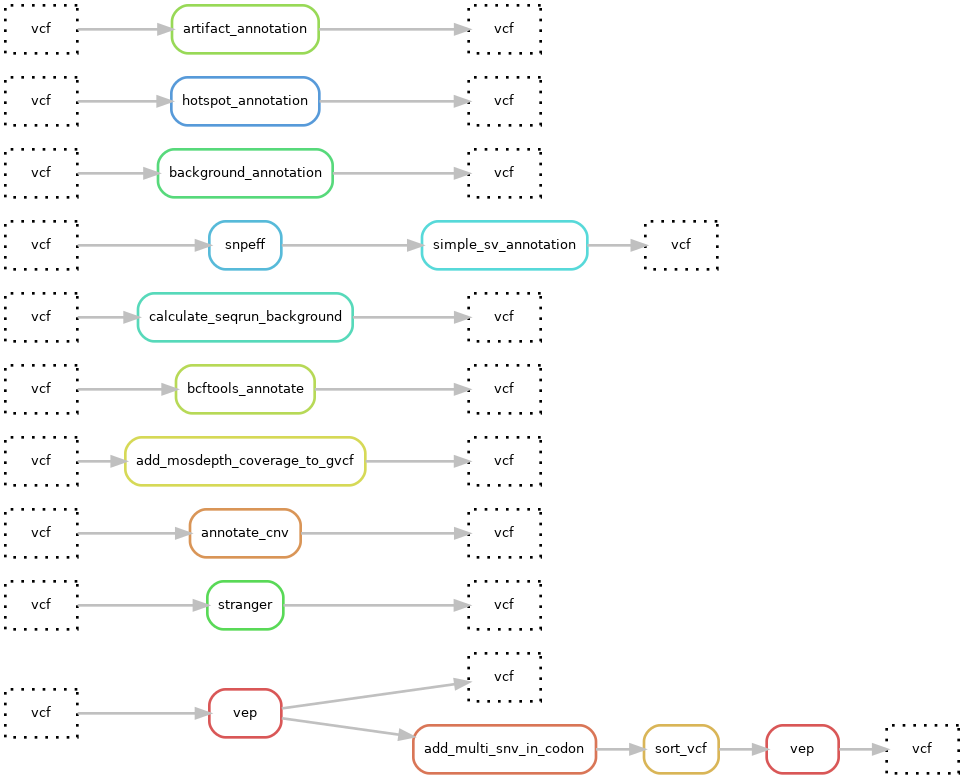

# Hydra-genetics alignment module
The annotation module consists of annotation steps, such as annotation of vcf files using VEP or SnpEff or adding artifact and background noise information. There are also simple tools for CNV and SV annotations in vcf files. Annotated output files will be tagged with the annotation tools but otherwise be identical to the input file, meaning that the annotation tools used are driven by the tags found in the final output files.

## Annotation

## Module input files
Variants in the `.vcf` file format.

* `{file}.vcf`

## Module output files
Annotated `.vcf` with annotation tags describing the annotation tools used. Examples:

* `{file}.vep_annotated.vcf`
* `{file}.vep_annotated.artifact_annotated.codon_snvs.vcf`
* `{file}.snpeff_annotated.vcf`
* `{file}.ss_annotated.vcf`
* `{file}.annotate_cnv.vcf`
